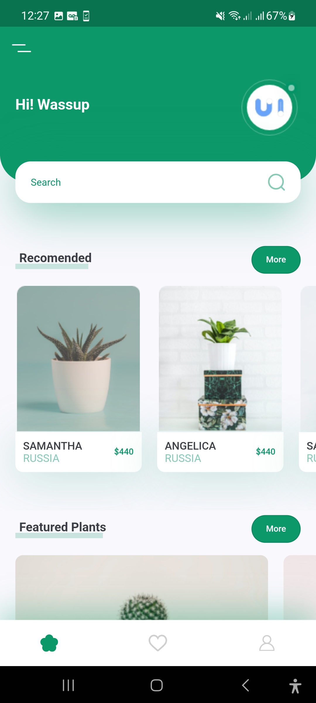
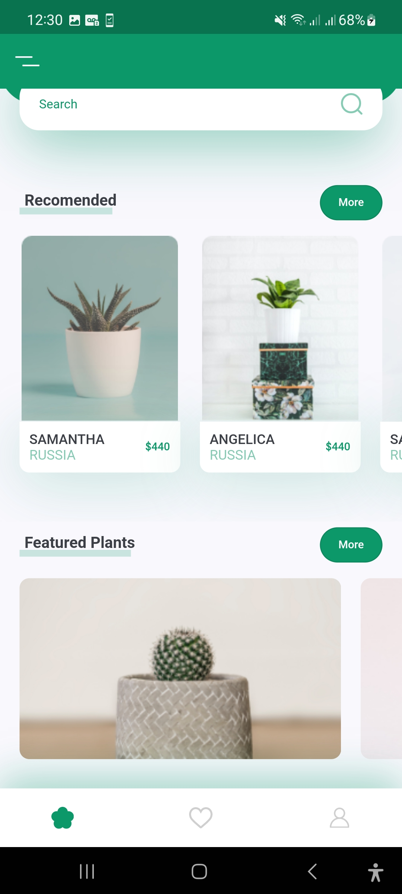
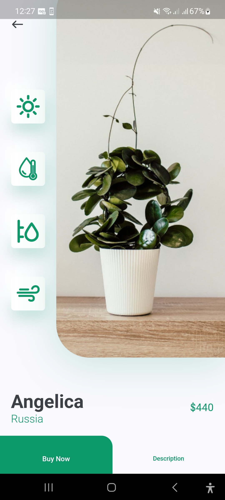

# Plants App

This project are made for studies proposes. Credits to [The Flutter Way Video](https://www.youtube.com/watch?v=LN668OAUrK4)

  
  
  

## Funcionalitties

- This app only show screens and dont offer backend connection

## Technologies

- Flutter
- Flutter SVG
